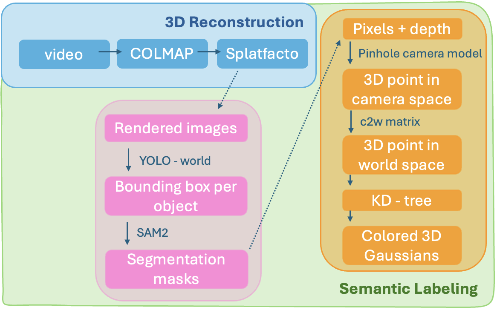
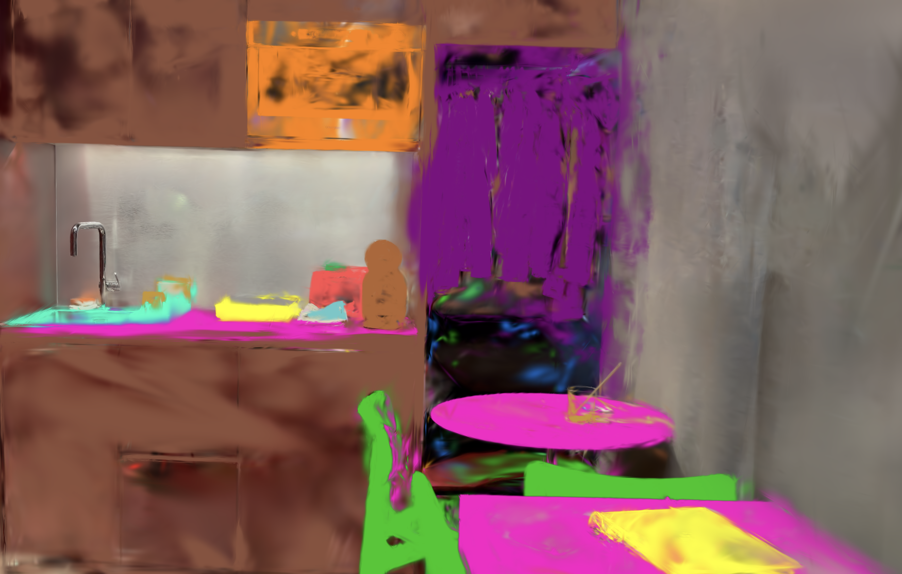
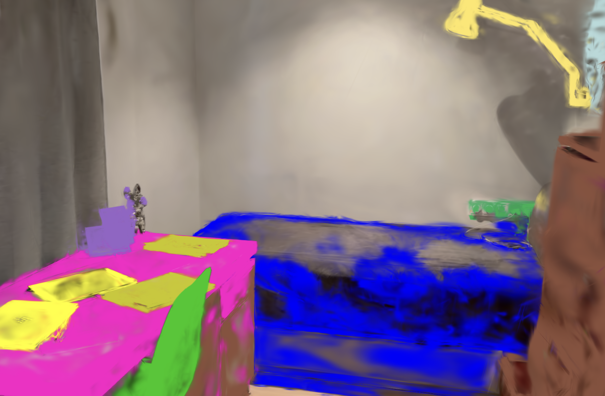

# 3D Semantic Labeling of Gaussian Splats

I automatically label 3D Gaussian splats with semantic object classes using open-vocabulary detection (YOLO-World) and instance segmentation (SAM2). 

## Quick Start

```bash
# 1. Clone the repository
git clone https://github.com/yourusername/gaussian-splat-labeling.git
cd gaussian-splat-labeling

# 2. Install dependencies
pip install -r requirements.txt

# 3. Train your Splatfacto model (see Step 1 below)
ns-process-data video --data /path/to/video.mp4 --output-dir ./data --matching-method sequential
ns-train splatfacto --data ./data --output-dir ./outputs

# 4. Render RGB and depth
python scr/render_raw_depth.py --config ./outputs/video_processed/splatfacto/[timestamp]/config.yml --output-dir ./raw_renders

# 5. Label your splat
python scr/label_gaussians.py --renders-dir ./raw_renders --splat-ply ./exports/splat.ply --output-dir ./output
```

The labeled splat is saved to `output/labeled_splat.ply`.

## Requirements

```
nerfstudio
ultralytics        # YOLO-World + SAM2
plyfile
scipy
opencv-python
numpy
torch
```

Install with:

```bash
pip install nerfstudio ultralytics plyfile scipy opencv-python numpy torch
```

YOLO-World and SAM2 model weights are downloaded automatically by Ultralytics on first run. You can also place them manually in the `models/` folder:
- `models/yolov8x-worldv2.pt`
- `models/sam2_b.pt`

## Supported Object Classes

`bed`, `wardrobe`, `desk`, `dining table`, `coffee table`, `kitchen counter`, `cabinet`, `chair`, `armchair`, `couch`, `laptop`, `monitor`, `tv`, `keyboard`, `mouse`, `sink`, `microwave`, `toaster`, `kettle`, `coffee machine`, `lamp`, `notebook`, `bottle`, `cup`, `plate`, `picture frame`, `mirror`, `backpack`, `suitcase`, `pillow`, `blanket`, `shower`, `bathtub`

## Pipeline Overview



## Design Choices and Tradeoffs

**3D Gaussian Splatting** — state of the art, fast to train, and produces good results.

**YOLO-World + SAM2** — I initially started with standard YOLO on its 80 fixed classes, but many objects weren't being detected. That led me to open-vocabulary detection, and YOLO-World is a good middle ground: fast, easy to use, and flexible since it allows custom class names. It gives bounding boxes, which I then feed into SAM2 for pixel-accurate masks.

**Depth backprojection + KD-tree voting** — I backproject labeled pixels into world space and find nearby Gaussians by radius. This is simple and decoupled from the rendering pipeline. A trade-off is that the object boundaries are not as sharp. 

**Multi-frame majority voting** — from previous experience, voting is a robust simple solution. Each Gaussian accumulates votes across all processed frames and only receives a label if one class wins by a clear majority (>50%) with enough votes (`--min-votes`), which filters out noisy detections from any one single frame.

**Frame and pixel subsampling** — `--frame-skip` and `--pixel-stride` allow a tradeoff between coverage and speed. For a first pass, `frame-skip=4` and `pixel-stride=8` runs in minutes; for final output, `frame-skip=1` and `pixel-stride=2` gives denser coverage.

## Results

### 3D Reconstruction

<video width="100%" controls>
  <source src="media/render.mp4" type="video/mp4">
</video>

### Semantic Labeling

<div style="display: flex; gap: 20px;">
  <div style="flex: 1;">
    
  </div>
  <div style="flex: 1;">
    
  </div>
</div>

## Limitations and Future Work

**Reconstruction quality** — although PSNR is over 32, there are visible artifacts and floaters in the scene. These also affect the labeling, since noisy geometry leads to noisy backprojections.

**No ceiling, floor, or walls** — I intentionally excluded these elements from the class list so the labeled output focuses on objects and looks cleaner visually.

**Fixed class list** — I defined the object classes manually, which isn't robust. A better approach would be to use a VLM to automatically identify all objects present in the scene. Going further, an agent could reason over conflicting labels (for example, if the same object gets two different labels across views, the agent could evaluate whether that's plausible given size and viewing angle, and resolve the conflict accordingly). I didn't do this approach given limited computational resources. 